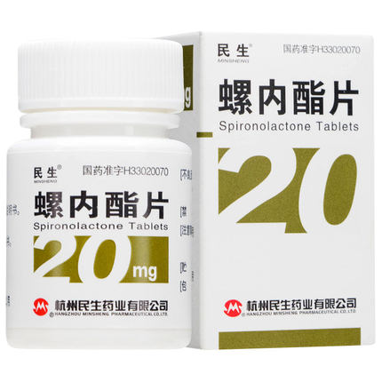


请仔细阅读说明书并在医师指导下使用药物。


螺内酯是保钾利尿药，用于治疗心衰、低钾血症和高血压等。但是，它也会阻断雄激素受体，从而具有抗雄激素特性；不过其效力较弱，需服用较大剂量方可充分起效（尿频等副作用也更明显）。

## 基本信息

|    一种常见的国产螺内酯片    |
| :--------------------------: |
|  |

- 药品名称：螺内酯片
- 英文名称：Spironolactone Tablets
- [说明书](./spironolactone-zh.pdf)

## 注意事项

开始服用螺内酯前，血清钾应小于 5.0mmol/L，肾功能应正常，服用螺内酯后定期监测血钾和肌酐[^1]；
避免过多食用富钾食品，如香蕉、海带、含钾代用盐等；
不得同时服用其它利钾药物；
多喝水。

## 使用方式与用量

口服。每天 40 - 200mg．分多次服用。**（部分包装有令人不适的苦味）**

## 副作用 [^1] [^2]

- **高钾血症**：螺内酯最严重的副作用，可导致住院甚至死亡。
  - 有以下风险因素者应慎用螺内酯：高年龄（超 45 岁）、肾功能不全、与其它利钾药物合用、钾补剂的服用等。
- **尿频**
- 血压过低
- 低钠血症
- 头晕
- 疲倦、困乏
- 干皮、皮疹
- 运动失调
- 皮质醇水平升高
- 胃肠道反应，包括恶心、呕吐、腹泻、胃痉挛、胃炎等

## 成分信息

- 有效成分：螺内酯（Spironolactone）
- 化学名称：17β-羟基-3-氧-7α-（乙酰硫基）-17α-孕甾-4-烯-21-羧基 γ-内酯
- 分子式：C24H32O4S
- 分子量：416.57

[^1]: [女性倾向跨性别者的激素治疗简介](https://tfsci.mtf.wiki/zh-cn/articles/transfem-intro/#spironolactone)
[^2]: [维基百科：螺内酯的副作用（英文）](https://en.wikipedia.org/wiki/Spironolactone#Side_effects)
